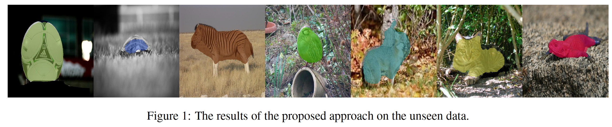

# LIDChallenge2020-NoPeopleAllowed
A 3rd place solution for [LID Challenge at CVPR 2020](https://lidchallenge.github.io/) on Weakly Supervised Semantic Segmentation. 

An implementation of the [NoPeopleAllowed: The Three-Step Approach to Weakly Supervised Semantic Segmentation](https://arxiv.org/abs/2006.07601) by Mariia Dobko, Ostap Viniavskiy, and Oles Dobosevych.

<p align="center"></p>

## Overview
We propose an approach to weakly supervised semantic segmentation, which consists of three consecutive steps.
The first two steps extract high-quality pseudo masks from image-level annotated data, which are then used to train a
segmentation model on the third step.

The presented approach also addresses two problems in the data: class imbalance and missing labels. Using only image-level
 annotations as supervision, our method is capable of segmenting various classes and complex objects. It achieves 37.34 mean 
 IoU on the test set, placing 3rd at the LID Challenge in the task of weakly supervised semantic segmentation.


## Data
Data is provided by a challenge organizers. The training dataset is available at [Imagenet DET](http://image-net.org/image/ILSVRC2017/ILSVRC2017_DET.tar.gz), 
val and test dataset are available at [Google Drive](https://drive.google.com/open?id=1B0enLzxyIULbRZWUi0XpNnXCu7nwFI-f).


## Usage

## Citation
```
@article{dobko2020lid,
     author = {Dobko, Mariia and Viniavskyi, Ostap and Dobosevych, Oles},
     title = {NoPeopleAllowed: The Three-Step Approach to Weakly Supervised Semantic Segmentation},
     journal = {The 2020 Learning from Imperfect Data (LID) Challenge - CVPR Workshops},
     year = {2020}
}
```
